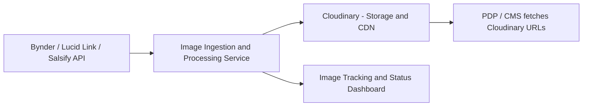

# Product Image Management Automation

---

## Executive Summary

The current manual process of managing product images for Product Detail Pages (PDPs) across Bynder, Lucid Link, and Salsify is inefficient, error-prone, and inconsistent in quality. This proposal outlines an automated solution leveraging API integrations and Cloudinary’s powerful image transformation and delivery features to streamline the ingestion, processing, and delivery of product images. The solution aims to reduce manual effort, ensure consistent high-quality images, and provide scalability for growing product catalogs.

---

## Understanding the Current Problem

- **Manual exports** from multiple source systems cause delays and inconsistencies.
- **Manual resizing and optimization** are time-consuming and vary in quality.
- **Manual upload** to Cloudinary introduces risk of human error.
- **Manual linking** of image URLs to PDPs delays product launches.
- Lack of automation **limits scalability** and **auditability**.

---

## Proposed Solution

Automate the product image pipeline using a centralized service that:

1. **Fetches images via APIs** from Bynder, Lucid Link, and Salsify.
2. **Uploads images directly to Cloudinary**.
3. Uses **Cloudinary transformations** for resizing, optimization, and formatting (e.g., WebP, adaptive quality).
4. Store **metadata and status in a tracking system** (database or dashboard).
5. Exposes an API or webhook for PDP to fetch image URLs dynamically or updates PDP CMS automatically.
6. Supports **incremental syncs** to handle new or updated images efficiently.

---

## High-Level Architecture Diagram

---

## Detailed Workflow Description
   
   ### The ingestion and processing pipeline can be initiated in several ways depending on deployment preferences and operational needs:

   - **Scheduled Jobs (e.g., Daily)** Use a scheduler to automatically trigger the image ingestion process at a set interval (e.g., once every 24 hours).
   - If hosted on Vercel, leverage `export const config = { schedule: 'cron expression' }` to run the endpoint on a cron-like schedule.
   - **Event-Driven Triggers** The ingestion can also be triggered manually or automatically when someone hits a dedicated API endpoint. This enables on-demand migrations or real-time syncing when new content is available.
   - **Self-Hosted or AWS Deployment** The ingestion service can be containerized and hosted in AWS (e.g., Lambda, ECS, or EC2) to support greater customization, logging, and scalability. AWS EventBridge or CloudWatch can handle cron scheduling, while API Gateway can trigger functions on demand.
   - **Fetching Images** The service calls APIs for Bynder, Lucid Link, and Salsify to list and retrieve new or updated images.

### Image Upload & Transformation:
   - Images are uploaded programmatically to Cloudinary.
   - During upload, Cloudinary transformations are applied: resizing (e.g., 500x400), format conversion (WebP), quality optimization, and cropping.
   - Use Cloudinary folders or tags to organize images by product or source.

### Metadata & Audit Logging:
   
   #### Option 1: Opensearch

   OpenSearch is a powerful, open-source log indexing and search engine suitable for custom, cost-effective observability setups.

   **Benefits:**

   - Fully open source and free to use (self-hosted)

   - Highly customizable dashboards via OpenSearch Dashboards

   - Powerful full-text search and filtering

   - Scalable log ingestion via API

   - Good for storing structured audit data (JSON logs)

   **Use Case Fit:**

   Best for teams that want full control over their log infrastructure and can manage self-hosted services (e.g., via Docker or Kubernetes)

   #### Option 2: Datadog

   Datadog is a premium, cloud-hosted observability platform with integrated logging, monitoring, and alerting.

   **Benefits:**

   - Turnkey setup—no infrastructure to manage

   - Built-in support for dashboards, alerts, and anomaly detection

   - Rich visualization and correlation across logs, metrics, traces

   - Supports log tailing, retention policies, and team collaboration

   - Seamless integration with Cloudinary, GitHub, AWS, Vercel, etc.

   **Trade-offs:**

   - Not fully free — free tier includes basic monitoring for up to 5 hosts but log management is a paid feature

   - Less customizable than OpenSearch but easier to get started

   **Use Case Fit:**

   - Ideal for teams looking for fast deployment, high reliability, and a strong UI/UX without needing to manage infrastructure.

### Image Delivery:
   - Cloudinary URLs with transformation parameters are exposed via an API or injected dynamically into the PDP/CMS.
   - PDPs load images optimized for device and bandwidth automatically.

### Incremental Updates:
   - The system detects new or updated images only, avoiding redundant uploads.
   - Supports manual re-sync for corrections.

---

## Key Cloudinary Capabilities Utilized

- **Upload API with transformations**: resize, crop, format conversion (e.g., to WebP), quality optimization.
- **Folders and tagging**: organize images for easier management.
- **CDN delivery**: fast, global image serving.
- **Dynamic URL generation**: serve images adapted to device and viewport.
- **Webhooks** (optional): notify the system or trigger workflows on upload events.

---

## Key Design Considerations

- **API Rate Limits**: Handle API rate limits gracefully with retries and batching.
- **Error Handling & Retry Logic**: Robust error handling for network/API failures.
- **Security**: Secure storage of API keys and tokens; secure communication with Cloudinary and source systems.
- **Scalability**: Design for high-volume image processing with horizontal scaling.
- **Extensibility**: Easy to add new source systems or modify transformation rules.
- **Audit & Monitoring**: Track progress, success, failures, and image metadata.

---

## Technology Stack & Justification

| Component                  | Technology/Tool           | Justification                                      |
|----------------------------|--------------------------|---------------------------------------------------|
| Image Ingestion & Processing| Node.js / Python service  | Wide ecosystem, easy API integration               |
| Scheduling                 | Cron (Kubernetes, AWS EventBridge, Vercel Cron) | Reliable and flexible scheduling                    |
| Source APIs                | RESTful APIs (Bynder, Lucid Link, Salsify) | Standardized access to source image repositories   |
| Cloud Storage & Delivery   | Cloudinary                | Powerful image transformation + global CDN         |
| Metadata & Audit Logging   | Datadog, Opensearch | **Datadog** has enterprise solutiong for tracking. **Opensearch** is an open source solution. |
| PDP Integration            | API / CMS Integration     | Dynamic image URL injection                         |
| Security                  | Vault or Environment Variables | Secure secrets management                           |

---

## Potential Challenges

- **API Changes**: Source system APIs might change, requiring maintenance.
- **Rate Limits and Quotas**: Need to handle and respect API usage limits.
- **Data Consistency**: Ensuring metadata matches images correctly, especially with incremental updates.
- **Error Recovery**: Handling partial failures without losing data or blocking pipelines.
- **Latency**: Large image batches might increase processing time; consider parallelism and throttling.
- **Access Control**: Proper permissions to fetch images from all source systems.

---
